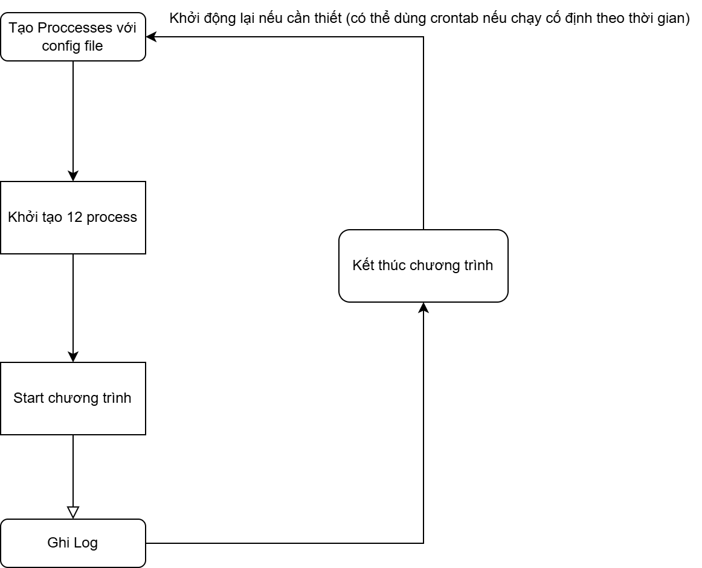

# Project cài đặt thuật toán SCHIPER-EGGLI-SANDOZ (SES)

# Table of Contents

-   [Project cài đặt thuật toán SCHIPER-EGGLI-SANDOZ (SES)](#project-cài-đặt-thuật-toán-schiper-eggli-sandoz-ses)
-   [Table of Contents](#table-of-contents)
    -   [Cấu trúc thư mục](#cấu-trúc-thư-mục)
    -   [Project Workflow](#project-workflow)
    -   [Code Run Command](#code-run-command)
    -   [References](#references)
    -   [YouTube Link](#youtube-link)

## Cấu trúc thư mục

```
└── 📁ses-ds-project
    └── 📁constant
        └── __init__.py
        └── config.py
    └── 📁logger
    └── 📁public
        └── workFlow.png
    └── 📁service
        └── __init__.py
        └── ses.py
    └── .gitignore
    └── main.py
    └── README.md
```

-   Bao gồm:
    -   📁constant: thư mục chứ file config bao gồm địa chỉ IP, port, số message 1 process cần gửi
    -   📁logger: thư mục chứa các file log của từng process với cấu trúc `process_log_{processId}`
    -   📁public: chứa các ảnh phục vụ cho việc viết docs và file README
    -   📁service: thư mục chứ các service cần thiết để khởi tạo và sử dụng 1 process bao gồm:
        -   `process_logger`: ghi thông tin log của 1 process
        -   `send_message`: gửi từng message
        -   `send_messages`: gửi nhiều message từ 1 process
    -   `main.py`: file thực thi chương trìnhtrình

## Project Workflow



-   Khi start chương trình => sẽ init 12 process với thông tin được define sẵn trong config.py
-   Mỗi process con sẽ được tạo số thread tương đương với numberProcess - 1

## Code Run Command

```shell
 python main.py
```

## References

-   Slide của thầy
-   GeeksForGeeks: https://www.geeksforgeeks.org/schiper-eggli-sandoz-protocol
-   Git repos: https://github.com/denizdanaei/DA_ex1

## YouTube Link

-   Module 6.2.2 SES Algorithm Causal Ordering of Messages: http://youtube.com/watch?v=y5HvzJjYhv8&t=534s
